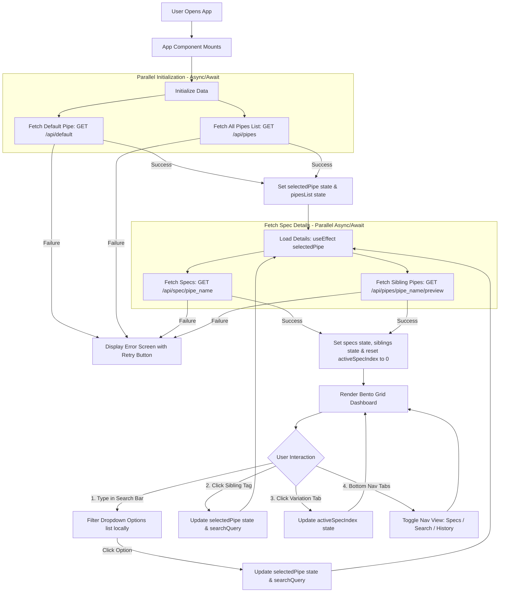

# EIL Specification Lookup System - Frontend Documentation

This repository contains the frontend application for the EIL (Engineers India Limited) Pipe Specification lookup system. The frontend is built inside the `frontend/` directory, linking directly to the FastAPI backend.

---

## 🛠️ Technology Stack & Architecture

The frontend is constructed using:
1. **Core UI**: React (Vite-powered, client-side rendering).
2. **Styling**: Native, clean Vanilla CSS (`App.css`). No utility classes (like Tailwind) are used, maintaining full compatibility with core style sheets and maximizing loading speeds.
3. **Data Fetching**: Pure modern JavaScript `async/await` syntax utilizing the browser's native `fetch` API.
4. **Icons**: Google Material Symbols Outlined.

---

## 📊 Frontend Architecture & Data Flow

Here is the flowchart representing the interaction flow, state lifecycle, and API integration in the frontend:



---

## 🎨 Design System

All styles are governed by the custom properties in `src/App.css`, which translates tokens from `frontend_ref/DESIGN.md`:
* **Colors**: Deep Industrial Navy (`#002046`) for layout structure, Safety Blue (`#005db6`) for primary interactions/accents, and a cool light-gray canvas (`#f8f9ff`).
* **Typography**: Clean `Inter` font for body and headings; `JetBrains Mono` for welding materials, thickness values, codes, and hardness specs.
* **Layout**: A responsive Bento-grid layout that shifts from a 12-column desktop grid to a single-column layout on mobile devices.
* **Border Radii**: Strict soft corner system (`8px` for data containers, `12px` for cards, and `9999px` for pill badges and navigation tags).

---

## ⚡ Core Features

1. **Searchable Selection Dropdown**: A custom-designed search input that filters the list of hundreds of EIL pipe specifications on-the-fly and handles selection cleanly.
2. **Double URL Encoding**: The API requests automatically double-encode the pipe names to prevent slashes in material codes (e.g. `ASTM A312 TP304/304L`) from breaking route parameters in the FastAPI backend or Vite proxy.
3. **Spec Variation Tabs**: When a single pipe material returns multiple welding specs (e.g. different code variations or joint preparation rules), a tab bar renders automatically, allowing engineers to toggle variations.
4. **Thermal parameters bento section**: Displays preheat thresholds, base temperatures, interpass maximums, and PWHT hold details side-by-side.
5. **Technical Notes Parser**: Notes are automatically split and parsed on numbered headings (`1.`, `2.`, etc.) to display clean, spaced bullet lists with custom styling.
6. **Lookup Session History**: Selecting the "History" tab on the bottom navigation lists the last 5 materials looked up in the session for quick toggling.

---

## 🚀 How to Run the Project

### 1. Start the Backend
Navigate to the `backend/` directory and run:
```bash
python -m uvicorn main:app --host 127.0.0.1 --port 8000
```

### 2. Run the Frontend
Navigate to the `frontend/` directory, install packages, and start the development server:
```bash
npm install
npm run dev
```
Open `http://localhost:5173/` in your browser.
